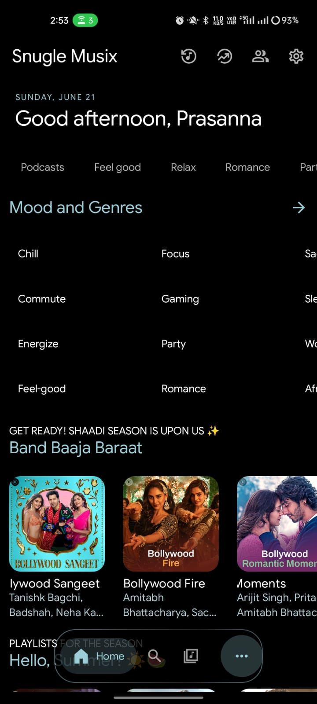

#  Snuggle Musix

A highly personalized, privacy-first Android music player featuring ad-free streaming, local playback, synced word-by-word lyrics, and smart, context-aware automation.

---

<p align="center">
  <a href="https://github.com/prasanna172605/Snugle-Musix/releases/latest">
    
  </a>
  <a href="https://github.com/prasanna172605/Snugle-Musix/stargazers">
    
  </a>
  <a href="LICENSE">
    
  </a>
</p>

<p align="center">
  <a href="https://prasanna0705.netlify.app/Snuggle-Musix">
    
  </a>
  &nbsp;&nbsp;
  <a href="https://github.com/prasanna172605/Snugle-Musix/releases/latest">
    
  </a>
</p>

---

## 🎨 Premium Experience, Uncompromising Freedom

Unlike generic music clients, **Snuggle Musix** bridges high-fidelity online streaming with your local library through a custom-built, modern interface. Built on top of robust architecture, it eliminates interruptions, tracks, and bloated subscriptions.

### 📸 Visual Walkthrough

<div align="center">
  <table>
    <tr>
      <td align="center" valign="top" width="33%">
        <b>Home Screen</b><br/><br/>
        
      </td>
      <td align="center" valign="top" width="33%">
        <b>Premium Player</b><br/><br/>
        
      </td>
      <td align="center" valign="top" width="33%">
        <b>Word-by-Word Lyrics</b><br/><br/>
        
      </td>
    </tr>
    <tr>
      <td align="center" valign="top" width="33%">
        <b>Smart Search</b><br/><br/>
        
      </td>
      <td align="center" valign="top" width="33%">
        <b>Library & Playlists</b><br/><br/>
        
      </td>
      <td align="center" valign="top" width="33%">
        <b>Snuggle Find</b><br/><br/>
        
      </td>
    </tr>
  </table>
</div>

---

## ⚡ The Snuggle Musix Core Pillars


### 🔍 Snuggle Find
Heard a song playing in your room or on a TV show? Instantly identify tracks playing around you via microphone fingerprinting, pulling up synced lyrics or adding it to your Snuggle Musix queue on the spot.

### 👥 Listen Together
Create real-time synchronized group listening sessions with friends. Perfect for long-distance movie nights, workouts, or workspace music sharing, featuring low-latency network syncing and instant QR-based connection invite codes.

### 📜 Lyrics+ & Translations
precise word-by-word synced scrolling, animated display states, and on-demand multilingual translations powered by local and cloud AI providers.

---

## 🚀 Key Feature Checklist

* **Zero Ads:** Complete uninterrupted playback.
* **Hybrid Storage:** Play high-quality online streaming feeds or play local files (`.mp3`, `.m4a`, `.flac`) seamlessly.
* **Smart Ringtones & Notifications:** Trim, download, and set any song as your default ringtone or notification sound directly.
* **Dynamic Themes:** Adapts to your device wallpaper colors (Material You), with dark modes and custom Apple-inspired player interfaces.
* **Spotify Integration:** Move your music catalog directly to Snuggle Musix by importing playlists in one tap.

---

## 🛠️ Build & Installation

### Option 1: Direct Installation
Grab the latest pre-compiled build from the [releases page](https://github.com/prasanna172605/Snugle-Musix/releases/latest) or check our [Official Download Webpage](https://prasanna0705.netlify.app/Snuggle-Musix).

### Option 2: Build From Source
To compile the FOSS or GMS variant locally:

1. **Clone the Repository**
   ```bash
   git clone https://github.com/prasanna172605/Snugle-Musix.git
   cd Snugle-Musix
   ```

2. **Configure SDK Path**
   Set up your Android SDK by creating a `local.properties` file in the root folder:
   ```bash
   echo "sdk.dir=/path/to/your/android/sdk" > local.properties
   ```
   *(For specific operating system paths, see [SETUP.md](SETUP.md))*

3. **Build Target APK**
   ```bash
   # Build FOSS Debug Variant (No Play Services)
   ./gradlew assembleUniversalFossDebug

   # Build GMS Debug Variant (With Cast Support)
   ./gradlew assembleUniversalGmsDebug
   ```

---

## 🤝 Project Acknowledgements

Snuggle Musix is proudly open-source. Special thanks to these exceptional projects:
* [Metrolist](https://github.com/MetrolistGroup/Metrolist) & [Vivi Music](https://github.com/vivizzz007/vivi-music) - Foundational project layout guidelines and architecture.
* [ArchiveTune](https://github.com/koiverse/ArchiveTune) - Aesthetic design concepts.
* [Better Lyrics](https://better-lyrics.boidu.dev/) & [SimpMusic](https://github.com/maxrave-dev/SimpMusic) - Sub-second lyrics sync logic.
* [Music Recognizer](https://github.com/aleksey-saenko/MusicRecognizer) - On-device audio fingerprinting.

---

<p align="center">
  Made with ❤️ by Prasanna and Contributors.
</p>
